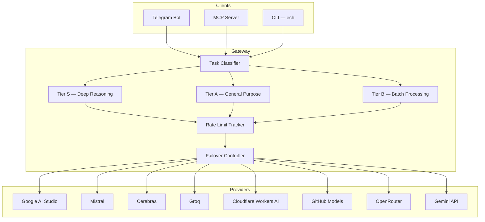

# Echeneis

**Unified AI gateway for multi-provider free-tier aggregation**

*Echeneis — the remora's scientific name, Greek for "ship-holder."*

A self-hosted AI gateway that unifies multiple LLM providers into a single OpenAI-compatible endpoint with intelligent routing, automatic failover, and rate limit management.

## Features

- **Unified OpenAI-compatible endpoint** — drop-in replacement for any OpenAI SDK client
- **Tiered routing** — task classifier routes requests to S/A/B model tiers based on complexity
- **Auto failover** — per-provider rate limit tracking with automatic fallback within tiers
- **Rate limit management** — tracks quotas across all providers, prevents wasted requests
- **Telegram Bot** — translation, summarization, vision, and document processing
- **MCP Server** — tool call entry point for Claude Code and other AI agents
- **CLI** — `ech` command for direct local invocation

## Architecture



## Supported Providers

| Provider | Model Families |
|----------|---------------|
| Google AI Studio | Gemma 4 (31B, 26B MoE) |
| Mistral | Mistral Large, Mistral Small |
| Cerebras | Llama |
| Groq | Llama 4, Llama 3 |
| Cloudflare Workers AI | 47+ open models |
| GitHub Models | GPT-4o |
| OpenRouter | Various open models |
| Gemini API | Gemini |

## Tiered Routing

| Tier | Purpose | Trigger |
|------|---------|---------|
| S | Deep reasoning, complex code review | `/think` command or classifier |
| A | General: translation, Q&A, code generation | Default |
| B | Batch processing, format conversion, labeling | `/fast` command or batch API |

Within each tier, tasks are routed to specific models by type (e.g., translation → Mistral, code → Gemma 4). Failover to backup models in the same tier occurs only when rate limits are reached.

## Quick Start

```bash
git clone https://github.com/tengigabytes/Echeneis.git
cd Echeneis

# Configure provider API keys
cp .env.example .env
# Edit .env with your API keys

# Start the gateway
docker-compose up -d
```

The gateway exposes an OpenAI-compatible endpoint at `http://localhost:4000`.

## Configuration

All configuration lives in `config/`:

- **`litellm_config.yaml`** — provider endpoints, model definitions, and API key references
- **`routing_rules.yaml`** — tier definitions, task-to-model mappings, and failover rules

See [docs/deployment.md](docs/deployment.md) for detailed deployment instructions.

## Project Structure

```
Echeneis/
├── config/
│   ├── litellm_config.yaml    # Provider and model configuration
│   └── routing_rules.yaml     # Routing rules and tier definitions
├── src/echeneis/
│   ├── gateway/               # Core routing and health checks
│   ├── bot/                   # Telegram bot
│   ├── mcp/                   # MCP server for agent integration
│   └── cli/                   # ech CLI tool
├── tests/
├── docs/
└── docker-compose.yml
```

## License

- Code: [Apache-2.0](LICENSE)
- Documentation: [CC-BY-SA 4.0](https://creativecommons.org/licenses/by-sa/4.0/)

---

*Designed in Formosa.*
