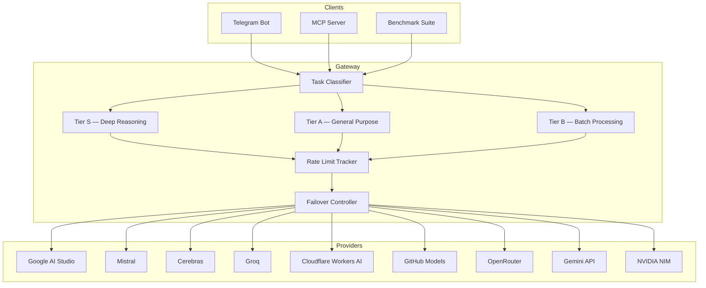

# Echeneis

**Unified AI gateway for multi-provider free-tier aggregation**

*Echeneis — the remora's scientific name, Greek for "ship-holder."*

A self-hosted AI gateway that unifies multiple LLM providers into a single OpenAI-compatible endpoint with intelligent routing, automatic failover, and rate limit management.

## Features

- **Unified OpenAI-compatible endpoint** — drop-in replacement for any OpenAI SDK client
- **Tiered routing** — task classifier routes requests to S/A/B model tiers based on complexity
- **Multi-provider failover chains** — each task lists fallbacks across distinct providers so a single outage can't break a tier
- **Rate limit management** — tracks quotas across all providers with persistent RPD counters that survive restarts
- **Telegram Bot** — multi-turn conversation, vision, translation, document processing, math output normalised to Unicode
- **Role-based access** — admin / guest / unregistered tiers, self-service registration via inline Approve/Deny keyboard, append-only audit log of every admin action
- **Usage dashboard** — per-user × per-model request counts over 1-day / 7-day / all-time windows, with nightly archive compaction
- **System monitoring** — `/status` dashboard, `/health` active probe (detects provider-side DEGRADED states), proactive alerts for VM resources, quota exhaustion, and circuit breaker events
- **In-bot ops** — `/broadcast`, `/logs`, `/reload`, `/adduser`, `/ban`, `/pending`, … for admin operations without an SSH session
- **MCP Server** — tool call entry point for Claude Code and other AI agents
- **Benchmark suite** — automated 7-dimension evaluation across all providers, with real-time Telegram progress updates
- **Graceful auto-deploy** — CI-gated, defers service restart when long-running tasks (benchmarks, etc.) are active

## Architecture



## Supported Providers

| Provider | Model Families |
|----------|---------------|
| Google AI Studio | Gemma 4 (31B, 26B MoE) |
| Mistral | Mistral Large, Mistral Small |
| Cerebras | Llama |
| Groq | Llama 4, Llama 3 |
| Cloudflare Workers AI | 47+ open models |
| GitHub Models | GPT-4o |
| OpenRouter | Various open models |
| Gemini API | Gemini |
| NVIDIA NIM | Nemotron Super, Mistral Large 3, Mistral Nemotron, Llama 4 Maverick, Gemma 3, Devstral |

## Tiered Routing

| Tier | Purpose | Trigger |
|------|---------|---------|
| S | Deep reasoning, complex code review | `/think` command or classifier |
| A | General: translation, Q&A, code generation | Default |
| B | Batch processing, format conversion, labeling | `/fast` command or batch API |

Within each tier, tasks are routed to specific models by type (e.g., translation → Mistral, code → Gemma 4). Failover to backup models in the same tier occurs only when rate limits are reached.

## Quick Start

```bash
git clone https://github.com/tengigabytes/Echeneis.git
cd Echeneis

# Configure provider API keys
cp .env.example .env
# Edit .env with your API keys

# Start the gateway
docker-compose up -d
```

The gateway exposes an OpenAI-compatible endpoint at `http://localhost:4000`.

## Configuration

All configuration lives in `config/`:

- **`litellm_config.yaml`** — provider endpoints, model definitions, and API key references
- **`routing_rules.yaml`** — tier definitions, task-to-model mappings, and failover rules

See [docs/deployment.md](docs/deployment.md) for detailed deployment instructions.

## Project Structure

```
Echeneis/
├── config/
│   ├── litellm_config.yaml    # Provider and model configuration
│   └── routing_rules.yaml     # Routing rules and tier definitions
├── src/echeneis/
│   ├── gateway/               # Core routing and health checks
│   ├── bot/                   # Telegram bot
│   └── mcp/                   # MCP server for agent integration
├── benchmarks/
│   ├── dimensions/            # 7 benchmark dimensions
│   ├── fixtures/              # Test data (datasheet, C code, images)
│   └── results/               # JSONL output (gitignored)
├── tests/
├── docs/
└── docker-compose.yml
```

## Benchmark Suite

Automated 7-dimension evaluation of all configured models against the live gateway. Measures latency, long-context recall, vision, code review, translation consistency, rate-limit resilience, and multi-turn context retention.

### Running Benchmarks

```bash
# Via CLI (gateway must be running)
python -m benchmarks run                                 # all dimensions, all models
python -m benchmarks run --dimension latency             # single dimension
python -m benchmarks run --dimension code_review --model gemma-4-31b

# View results
python -m benchmarks results                             # latest run
python -m benchmarks results --compare-last 2            # regression detection

# Via pytest
pytest benchmarks/ -m latency                            # single dimension
pytest benchmarks/ -k "groq"                             # filter by model name
```

### Running from Telegram

```
/bench                              # all dimensions × all models
/bench latency                      # single dimension
/bench latency groq-llama-70b       # specific dimension + model
/bench all groq-llama-70b           # all dimensions, one model
```

Progress is reported in real-time during the run, and the final report is pushed when complete. Results are saved to `benchmarks/results/results.jsonl` for historical comparison.

### Dimensions

| # | Dimension | Metric | Per-model Requests |
|---|-----------|--------|--------------------|
| 1 | `latency` | p50, p95 (ms) | 10 |
| 2 | `context_recall` | Questions correct out of 5 | 5 |
| 3 | `vision` | Register values extracted out of 3 | 1 |
| 4 | `code_review` | Planted bugs found out of 6 | 1 |
| 5 | `translation` | Technical terms preserved out of 6 | 1 |
| 6 | `multi_turn` | Context markers retained out of 4 | 4 |
| 7 | `rate_limit` | Success rate under 5× concurrency | 50 (shared) |

A full run across all models uses approximately 308 requests.

## Telegram Bot

### Commands

**Public (anyone, including unregistered users)**

| Command | Description |
|---------|-------------|
| `/start` | Welcome; shows your Telegram ID and current role |
| `/help` | Role-aware command list |
| `/whoami` | Your ID, username, and role (admin / guest / unregistered) |
| `/request [reason]` | Submit a registration request for admin approval |

**Registered user (admin + guest)**

| Command | Description |
|---------|-------------|
| `/think <msg>` | Deep reasoning mode (Tier S) |
| `/fast <msg>` | Quick batch mode (Tier B) |
| `/models` | List available models with live quota |
| `/use <model> <msg>` | Route to a specific model |
| `/model` | Show current routing and health status |
| `/status` | Dashboard — VM resources, gateway health, quota, and usage table |
| `/raw` | Toggle automatic LaTeX/Markdown → Unicode conversion on replies |

**Admin-only**

| Command | Description |
|---------|-------------|
| `/adduser <id> [name]` | Register a new guest |
| `/removeuser <id>` | Remove a guest |
| `/listusers` | List admins and guests |
| `/ban <id>` / `/unban <id>` | Soft-disable / reinstate a guest |
| `/whois <id>` | Look up a user's registration record |
| `/pending` | List open registration requests |
| `/broadcast <msg>` | Send a message to every admin and non-banned guest |
| `/logs [N]` | Last N WARNING+ log lines from bot and gateway |
| `/health` | Active probe of every model (detects DEGRADED / rate limited / timeout) |
| `/reload` | Hot-reload users.json, pending_requests.json, and the prompt cache |
| `/eviction` | Anti-eviction idle-service status |
| `/bench` | Run benchmark suite |

Send text directly for general conversation (Tier A), photos for vision analysis, or files for document processing. Reply to a bot message to continue multi-turn conversation (up to 6 turns). Unregistered users receive a one-tap inline keyboard to submit an access request.

### Monitoring and Alerts

The bot includes a background system monitor that sends proactive alerts to the admin chat:

| Alert | Trigger | Cooldown |
|-------|---------|----------|
| 🟢 Bot startup | Container start | — |
| 🔴 CPU high | Load > 80% sustained | 1 hour |
| 🔴 Memory low | RAM usage > 90% | 1 hour |
| 🔴 Disk low | Disk usage > 85% | 1 hour |
| 💀 Quota exhaustion | RPD usage ≥ 90% per model | 1 hour |
| ⚠️ Circuit breaker open | 3 consecutive provider failures | On event |
| ✅ Circuit breaker close | Provider recovered | On event |

Use `/status` to query all metrics on demand. Set `TELEGRAM_ADMIN_CHAT_ID` to route alerts to a separate admin chat.

## Baseline Results (2026-04-11)

Comparative evaluation across Echeneis model pool, Claude Sonnet 4.6, and Claude Opus 4.6 on seven dimensions.

### 1. Latency (10 runs per model, same prompt, max_tokens=64)

| Model | Provider | p50 (ms) | p95 (ms) | Reliability |
|-------|----------|:--------:|:--------:|:-----------:|
| groq-llama-70b | Groq | **309** | 662 | 10/10 |
| groq-llama-4-scout | Groq | 402 | 762 | 10/10 |
| cerebras-llama-8b | Cerebras | 426 | 1,280 | 10/10 |
| mistral-large-3 | Mistral | 1,169 | 3,872 | 10/10 |
| mistral-small-3.1 | Mistral | 1,188 | 1,953 | 10/10 |
| Sonnet 4.6 | Anthropic | ~1,600 | ~2,100 | 3/3 |
| or-gemini-flash-lite | OpenRouter | 2,218 | 12,097 | 10/10 |
| Opus 4.6 | Anthropic | ~5,000 | ~15,000 | — |
| or-nemotron-120b | OpenRouter | 8,032 | 27,295 | 10/10 |
| gemma-4-26b | Google AI Studio | 8,802 | 11,252 | 10/10 |
| gemma-4-31b | Google AI Studio | 9,120 | 10,093 | 10/10 |
| github-gpt-4o | GitHub Models | — | — | 0/10 (PAT permission) |

### 2. Long Context Recall (SX1276 datasheet, ~5K chars, 5 factual questions)

| Model | Score | Notes |
|-------|:-----:|-------|
| gemma-4-31b | **5/5** | Precise and concise |
| or-gemini-flash-lite | **5/5** | Most detailed answers |
| Sonnet 4.6 | **5/5** | Included register addresses |
| Opus 4.6 | **5/5** | Added duty cycle detail |
| gemma-4-26b | 4/5 | |
| mistral-large-3 | 4/5 | |
| mistral-small-3.1 | 4/5 | |
| groq-llama-70b | 4/5 | |
| groq-llama-4-scout | 4/5 | |
| or-nemotron-120b | 4/5 | |
| cerebras-llama-8b | 4/5 | Confused RegPaConfig with RegOpMode description |

### 3. Vision (register map image → factual extraction)

| Model | Score | Notes |
|-------|:-----:|-------|
| gemma-4-31b | **3/3** | |
| gemma-4-26b | **3/3** | |
| mistral-large-3 | **3/3** | |
| or-gemini-flash-lite | **3/3** | |
| Sonnet 4.6 | **3/3** | |
| Opus 4.6 | **3/3** | |
| groq-llama-70b | — | Text-only model, no multimodal support |
| groq-llama-4-scout | — | Text-only |
| cerebras-llama-8b | — | Text-only |
| or-nemotron-120b | — | Text-only |

### 4. Code Review (embedded C, SX1276 SPI driver, 6 planted bugs)

| Model | Bugs Found | Bonus Findings | Grade |
|-------|:----------:|:--------------:|:-----:|
| Sonnet 4.6 | 6/6 | +2 (IRQ_RX_DONE never checked, MaxPower bit field) | **A+** |
| gemma-4-31b | 6/6 | +1 (burst read perf) | A |
| gemma-4-26b | 6/6 | +1 (burst read perf) | A |
| or-gemini-flash-lite | 6/6 | +1 (burst read perf) | A |
| Opus 4.6 | 6/6 | +1 (burst read perf) | A |
| mistral-large-3 | 5/6 | | B+ |
| mistral-small-3.1 | 5/6 | | B+ |
| groq-llama-70b | 5/6 | | B+ |
| groq-llama-4-scout | 5/6 | | B+ |
| or-nemotron-120b | 5/6 | | B+ |
| cerebras-llama-8b | 4/6 | | B |

### 5. Translation (6 domain terms to preserve untranslated)

| Model | Terms Preserved | Missing |
|-------|:---------------:|---------|
| Opus 4.6 | **6/6** | — |
| gemma-4-31b | **6/6** | — |
| gemma-4-26b | **6/6** | — |
| mistral-large-3 | **6/6** | — |
| mistral-small-3.1 | **6/6** | — |
| or-gemini-flash-lite | **6/6** | — |
| or-nemotron-120b | **6/6** | — |
| Sonnet 4.6 | 5/6 | watchdog timer |
| groq-llama-70b | 5/6 | firmware (typo) |
| groq-llama-4-scout | 4/6 | watchdog timer, system reset |
| cerebras-llama-8b | 3/6 | watchdog timer, system reset, prescaler |

**Note**: Auto-router misclassified translation as general task, routing to B-tier (cerebras-llama-8b, 3/6). When explicitly routed to A-tier models, all achieve 6/6.

### 6. Rate Limit Stress Test (50 requests, 5 concurrent)

| Metric | Result |
|--------|--------|
| Success rate | **98%** (49/50) |
| Total time | 73.5s |
| Avg latency | 1,228 ms |
| Models used | gemma-4-31b (15), cerebras-llama-8b (34) |
| Failover | Automatic provider switching confirmed |

### 7. Multi-turn Conversation (4 turns, context retention)

All 10 Echeneis models + Sonnet + Opus achieved **complete** recall (name, project, SF, full summary). Session sticky ensures the same model is used throughout a reply chain, preventing mid-conversation model switching.

| Model | Summary Quality |
|-------|:---------------:|
| gemma-4-31b | Complete |
| gemma-4-26b | Complete |
| mistral-large-3 | Complete |
| mistral-small-3.1 | Complete |
| groq-llama-70b | Complete |
| groq-llama-4-scout | Complete |
| cerebras-llama-8b | Complete |
| or-gemini-flash-lite | Complete |
| or-nemotron-120b | Complete |
| Sonnet 4.6 | Complete |
| Opus 4.6 | Complete |
| Echeneis (auto-routed) | Complete — session sticky keeps model consistent across turns |

### Overall Rankings

| Model | Latency | Context | Vision | Code Review | Translation | Multi-turn | Overall |
|-------|:-------:|:-------:|:------:|:-----------:|:-----------:|:----------:|:-------:|
| Opus 4.6 | ~5s | 5/5 | 3/3 | A | 6/6 | Complete | **S** |
| Sonnet 4.6 | ~1.6s | 5/5 | 3/3 | A+ | 5/6 | Complete | **S** |
| gemma-4-31b | 9.1s | 5/5 | 3/3 | A | 6/6 | Complete | **A** |
| or-gemini-flash-lite | 2.2s | 5/5 | 3/3 | A | 6/6 | Complete | **A** |
| mistral-large-3 | 1.2s | 4/5 | 3/3 | B+ | 6/6 | Complete | **A** |
| gemma-4-26b | 8.8s | 4/5 | 3/3 | A | 6/6 | Complete | **A-** |
| mistral-small-3.1 | 1.2s | 4/5 | — | B+ | 6/6 | Complete | **B+** |
| groq-llama-70b | 0.3s | 4/5 | — | B+ | 5/6 | Complete | **B+** |
| groq-llama-4-scout | 0.4s | 4/5 | — | B+ | 4/6 | Complete | **B+** |
| or-nemotron-120b | 8.0s | 4/5 | — | B+ | 6/6 | Complete | **B** |
| cerebras-llama-8b | 0.4s | 4/5 | — | B | 3/6 | Complete | **B-** |
| github-gpt-4o | — | — | — | — | — | — | **N/A** |

### Recommendations

| Task Type | Recommended Model | Rationale |
|-----------|------------------|-----------|
| Architecture decisions, complex debugging | Opus 4.6 | Irreplaceable for safety-critical reasoning |
| Code review (embedded) | Sonnet 4.6 | A+ — found hidden MaxPower bit field bug |
| Code generation | Gemma 4 31B or Sonnet | Both A-grade; Gemma is zero-cost |
| Translation | Mistral Large (explicit route) | 6/6 term preservation, matches Opus |
| Vision / datasheet reading | Gemma 4 31B | 3/3, equivalent to Opus/Sonnet |
| Batch tasks, format conversion | Groq Llama 70B | 309ms p50, sufficient quality |
| Low-latency interactive | Groq / Cerebras | Sub-500ms for simple queries |

## License

- Code: [Apache-2.0](LICENSE)
- Documentation: [CC-BY-SA 4.0](https://creativecommons.org/licenses/by-sa/4.0/)

---

*Designed in Formosa.*
